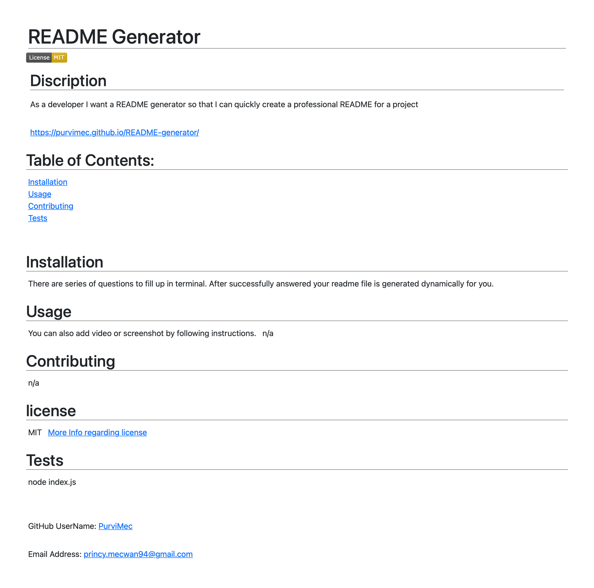

# README Generator

## Discription
As a developer I want a README generator so that I can quickly create a professional README for a project

## URL to deploy application 

https://purvimec.github.io/README-generator/

## Table of Contents:
- Installation
- Usage
- Contributing
- Tests

## Installation
There are series of questions to fill up in terminal. After successfully answered your readme file is generated dynamically for you. download npm init and npm install inquirer.

## Usage
After download and answering questions you can also add screenshot using this path. 

## Tests
node index.js

## Contribution
Made with ❤️ by Purvi Mecwan

### ©️2021 README Generator, Inc
